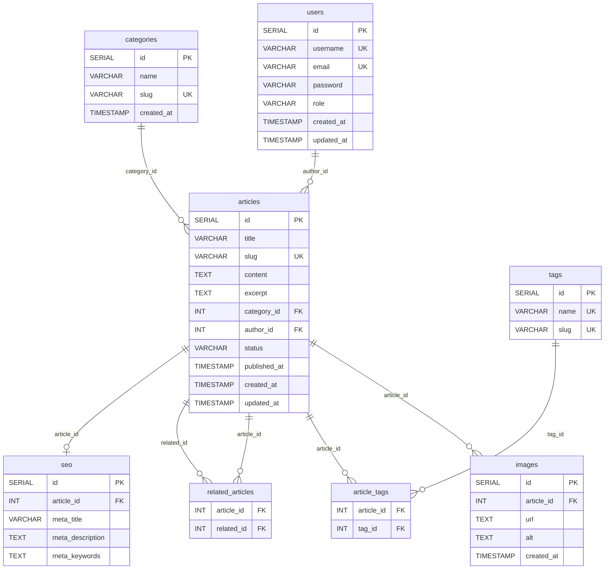

# Documentation Technique — Iran News

## Informations générales

| Info | Détail |
|---|---|
| **Projet** | Iran News — Site d'actualités sur la guerre en Iran |
| **Num ETU** | ETU003310 |
| **Technologies** | PHP 8.1, PostgreSQL 15, Apache (mod_rewrite), Docker |
| **Éditeur de contenu** | TinyMCE 7 (installation locale) |
| **Architecture** | MVC (Model-View-Controller) |
| **URL locale** | `http://localhost:8000` |

---

## Accès au Backoffice

| Champ | Valeur |
|---|---|
| **URL de connexion** | `http://localhost:8000/admin/login` |
| **Email admin** | `admin@irannews.com` |
| **Mot de passe** | `password` |
| **Email éditeur** | `editeur@irannews.com` |
| **Mot de passe** | `password` |

---

## Modélisation de la base de données



---

## Structure du projet

```
iran-news/
├── config/             # Configuration (base de données, constantes)
├── public/             # Point d'entrée (index.php, .htaccess)
├── sql/                # Scripts SQL (init.sql, seed.sql)
├── src/
│   ├── controllers/    # Contrôleurs (AdminController, ArticleController, HomeController)
│   ├── core/           # Noyau (Router, Database, Session)
│   └── models/         # Modèles (Article, Category, User, Tag)
├── templates/
│   ├── admin/          # Vues Backoffice (dashboard, articles, catégories)
│   ├── front/          # Vues Frontoffice (accueil, article, catégorie, 404)
│   └── layout/         # Layout commun (header.php, footer.php)
├── tinymce/            # Éditeur TinyMCE (installation locale)
├── uploads/            # Images uploadées par les utilisateurs
├── Dockerfile          # Image PHP 8.1 Apache + mod_rewrite + pdo_pgsql
└── docker-compose.yml  # Orchestration Docker (web + db)
```

---

## Captures d'écran — Frontoffice (FO)

### Page d'accueil
<!-- Remplacez le chemin ci-dessous par votre capture d'écran -->
> 📸 *À ajouter : capture de la page d'accueil (`http://localhost:8000`)*

### Page article (détail)
<!-- Remplacez le chemin ci-dessous par votre capture d'écran -->
> 📸 *À ajouter : capture d'un article avec images et articles référencés*

### Page catégorie
<!-- Remplacez le chemin ci-dessous par votre capture d'écran -->
> 📸 *À ajouter : capture d'une page catégorie (`/category/politique`)*

---

## Captures d'écran — Backoffice (BO)

### Page de connexion
<!-- Remplacez le chemin ci-dessous par votre capture d'écran -->
> 📸 *À ajouter : capture de la page login (`/admin/login`)*

### Tableau de bord
<!-- Remplacez le chemin ci-dessous par votre capture d'écran -->
> 📸 *À ajouter : capture du dashboard admin (`/admin`)*

### Liste des articles
<!-- Remplacez le chemin ci-dessous par votre capture d'écran -->
> 📸 *À ajouter : capture de la liste des articles (`/admin/articles`)*

### Formulaire d'ajout/édition d'article (TinyMCE)
<!-- Remplacez le chemin ci-dessous par votre capture d'écran -->
> 📸 *À ajouter : capture du formulaire avec TinyMCE visible (`/admin/editarticle`)*

### Gestion des catégories
<!-- Remplacez le chemin ci-dessous par votre capture d'écran -->
> 📸 *À ajouter : capture de la liste des catégories (`/admin/categories`)*

---

## Fonctionnalités implémentées

### Backoffice
| # | Module | Description | Statut |
|---|---|---|---|
| 9 | Gestion Catégorie | Liste des catégories | ✅ 100% |
| 10 | Gestion Catégorie | Ajout catégorie (formulaire HTML) | ✅ 100% |
| 11 | Gestion Catégorie | Traitement ajout catégorie en base | ✅ 100% |
| 12 | Gestion Catégorie | Modification / suppression catégorie | ✅ 100% |
| 13 | Gestion Article | Formulaire ajout : HTML + images + articles référencés | ✅ 100% |
| 14 | Gestion Article | Intégration TinyMCE pour saisie HTML | ✅ 100% |
| 15 | Gestion Article | Upload images sur serveur | ✅ 100% |
| 16 | Gestion Article | Insertion en base (HTML + images + références) | ✅ 100% |
| 17 | Gestion Article | Liste articles + édition / suppression | ✅ 100% |
| 18 | Gestion Article | Modification article (TinyMCE + images) | ✅ 100% |

### Frontoffice
| # | Module | Description | Statut |
|---|---|---|---|
| 19 | Structure | Layout sémantique (header, nav, footer, h1-h6) | ✅ 100% |
| 20 | Accueil | Liste articles paginée par catégorie | ✅ 100% |
| 21 | Article | Affichage complet + articles référencés | ✅ 100% |
| 22 | SEO | URL Rewriting (`/article/slug`, `/category/slug`) | ✅ 100% |
| 23 | SEO | Balises méta dynamiques (title, description, Open Graph) | ✅ 100% |
| 24 | SEO | Attribut `alt` sur toutes les images | ✅ 100% |

---

## Lancement du projet

```bash
# Démarrer les conteneurs Docker
docker-compose up -d --build

# Vérifier que le site est accessible
# Frontoffice : http://localhost:8000
# Backoffice  : http://localhost:8000/admin/login
```
